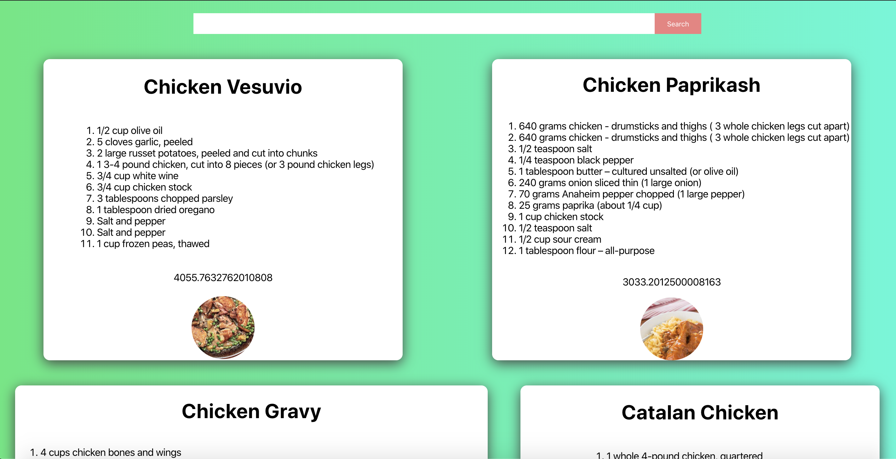
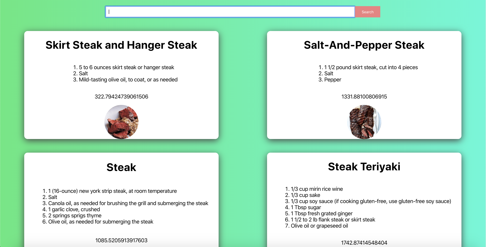

# Recipe App
https://afternoon-beach-71846.herokuapp.com/
## Overview
Recipe App is a simple React application that allows the user to search for an ingrediant or type of food and receive a list of food recipes containing the searched for food, the calories, and an image.
## How It Works
Simply enter a food of your choosing into the search bar and press enter. The application will pull the related information from the Edamam API and display that selected info on the screen.
## Technologies Used
This application solely uses React and Edamam API.
## Role
This is an independent, React practice-project.
## Screenshots

